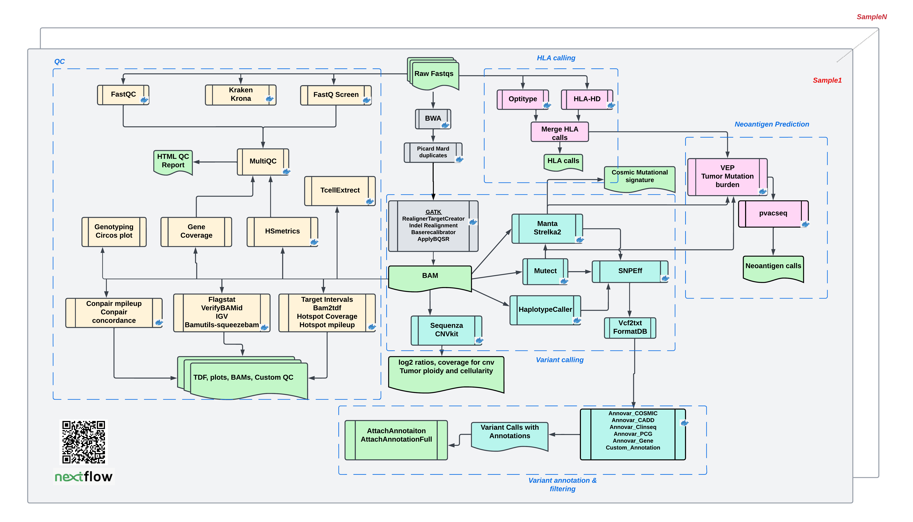

## Overview of the workflow

This next-generation sequencing (NGS) pipeline is containerized, platform-independent, uses Nextflow DSL2 workflow, and currently operates on NIH's Biowulf HPC cluster and the AWS cloud. This Exome-RNAseq workflow performs extensive quality control, mutational calling, tumor mutational burden assessment, mutational signatures, HLA typing, copy number calling, T-cell infiltration prediction, neoantigen prediction, gene expression profiling, fusion detection, variant calling, and annotation. This comprehensive suite is crucial for deep genomic characterization, addressing both research samples and clinical patient data at NIH. The [ClinOmics data portal](https://oncogenomics.ccr.cancer.gov/production/public/) extends these capabilities by offering a user-friendly web portal for data exploration.

Here is a Snapshot of our RNAseq and Exome workflows.

### RNAseq Workflow


### Exome Workflow



## Prerequisites

To run this workflow, you will need the following software:

```
	Nextflow >= 21.04.3
	Singularity 3.10.5
	Graphviz 2.40
```

## Installation

Please clone this repository to your local filesystem using the following command:

```
        git clone https://github.com/CCRGeneticsBranch/Oncogenomics_NF_WF.git
        cd Oncogenomics_NF_WF
```

## Setting up the workflow on biowulf

1. This workflow is hosted on biowulf in khanlab space /data/khanlab/projects/Nextflow_dev/dev/AWS_POC_Nextflow.
2. All the pipeline config can be accessed using nextflow.config file.
3. Within the nextflow.config file you can select the profile to launch the pipeline. To run pipeline on biowulf select profile `biowulf`. This is set up to work with biowulf batch resources.
4. Guidelines to create an input samplesheet can be found [here](samplesheet.md).
5. All the references, annotation and bed files are currently located under /data/khanlab. We currently support data processing for these capture kits.

### Sequencing capture kits

| RNAseq         | Exome             |
| -------------- | ----------------- |
| Access         | clin_ex_v1        |
| PolyA          | seqcapez.hu.ex.v3 |
| PolyA_stranded | Agilent_v7        |
| Ribozero       | idt_v2_plus       |
| smartrna       | xgen_hyb_panelv2  |
|                | seqcapez_hu_ex_v3 |

If you want to process the data sequenced by other kits, please reach out to [Vineela Gangalapudi](mailto:vineela.gangalapudi@nih.gov).
