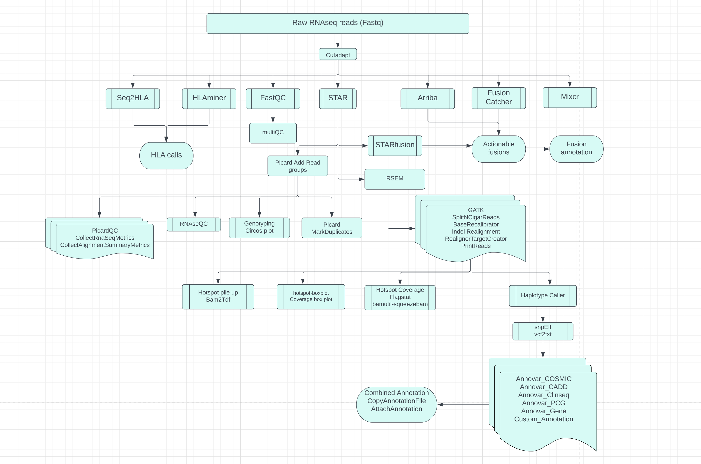

## Overview of the workflow
This RNAseq workflow, based on Nextflow, performs a series of tasks to analyze transcript abundances, identify variants, and perform quality control. It includes 
read trimming, paired-end alignment using STAR, quantification of transcript abundances, fusion calling, variant analysis using GATK, and annotation using Annovar. 



# Prerequisites
To run this workflow, you will need the following software:
```	
	Nextflow >= 21.04.3
	Singularity 3.10.5
	Graphviz 2.40
```


# Installation
Please clone this repository to your local filesystem using the following command:

```
        git clone https://github.com/CCRGeneticsBranch/AWS_POC_Nextflow.git
        cd AWS_POC_Nextflow/ 
        git checkout feature/casename
```


# Setting up the workflow on biowulf
1. The workflow is hosted on biowulf in khanlab space /data/khanlab/projects/Nextflow_dev/AWS_POC_Nextflow.
2. All the pipeline config can be accessed using nextflow.config file. The workflow config is currently set up to work with Biowulf batch resources.
4. For initial testing purposes we suggest running the workflow with outdir pointed to /data/khanlab2/NF_benchmarking. If needed, modify the path for the 
`export OUTDIR` variable in the script `nf.sh` 
 

# Running the workflow.
 The workflow can be started by executing the `launch.sh` script in a interactive node. This wrapper script spawns new jobs and submits them to the SLURM 
scheduling system.


 ```
        sh launch.sh tag /path/to/samplesheet        
        This script takes two inputs
        Provide Tag argument - This will add a tag to your resultsdir.
        Provide samplesheet with complete path
        example: sh launch.sh projectname /path/to/samplesheet  #this will create work.projectname and results.projectname folders under `OUTDIR` path.
        
 ```

### Case1:
Test samplesheet with subsamples is available here `/data/khanlab/projects/Nextflow_dev/testing/exome-rnaseq_samplesheet.csv`
### Case2: 
Test samplesheet with 20 samples is available here `/data/khanlab/projects/Nextflow_dev/testing/20_samplesheet.csv`

To ensure you dont run into permission issues please run the #Case1 before launching full samples with #Case2

The following command should kick initiate the pipeline and display the status.

`sh launch.sh vg0416 /data/khanlab/projects/Nextflow_dev/testing/exome-rnaseq_samplesheet.csv`
                                                or 
`sbatch --mem=50g --time=24:00:00 sh launch vg0416 /data/khanlab/projects/Nextflow_dev/testing/exome-rnaseq_samplesheet.csv`
# Workflow log
When the workflow is launched, it will produce a log that provides information about the pipeline execution, including the command line used, the version of Nextflow, the input folder path, the results directory, and the work directory.


```
[gangalapudiv2@cn4305 AWS_POC_Nextflow]$ ./launch.sh vg0416
[+] Loading singularity  3.10.5  on cn4305 
[+] Loading java 17.0.3.1  ... 
[+] Loading nextflow  23.04.1 
[+] Loading Graphviz v 2.46.1  ... 
NXF_HOME=/data/khanlab2/NF_benchmarking/results.vg0416/.nextflow
nextflow run -c /vf/users/khanlab/projects/Nextflow_dev/AWS_POC_Nextflow/nextflow.config -profile biowulf_test_run_slurm 
/vf/users/khanlab/projects/Nextflow_dev/AWS_POC_Nextflow/main.nf -resume -with-trace -with-timeline
N E X T F L O W  ~  version 23.04.1
Launching `/vf/users/khanlab/projects/Nextflow_dev/AWS_POC_Nextflow/main.nf` [gigantic_moriondo] DSL2 - revision: 47347c03a7
R N A S E Q - N F   P I P E L I N E  
===================================
NF version   : 23.04.1
runName      : gigantic_moriondo
username     : gangalapudiv2
configs      : [/vf/users/khanlab/projects/Nextflow_dev/AWS_POC_Nextflow/nextflow.config, 
/vf/users/khanlab/projects/Nextflow_dev/AWS_POC_Nextflow/nextflow.config]
profile      : biowulf_test_run_slurm
cmd line     : nextflow run -c /vf/users/khanlab/projects/Nextflow_dev/AWS_POC_Nextflow/nextflow.config -profile biowulf_test_run_slurm 
/vf/users/khanlab/projects/Nextflow_dev/AWS_POC_Nextflow/main.nf -resume -with-trace -with-timeline
start time   : 2023-07-14T08:38:30.805092321-04:00
projectDir   : /vf/users/khanlab/projects/Nextflow_dev/AWS_POC_Nextflow
launchDir    : /gpfs/gsfs10/users/khanlab2/NF_benchmarking/results.vg0416
workdDir     : /data/khanlab2/NF_benchmarking/work.vg0416
homeDir      : /home/gangalapudiv2
[bc/d5f459] process > RNAseq_multiple_libs:Common_RNAseq_WF:Cutadapt (Test1c_R_T)                           [100%] 2 of 2, cached: 2 ✔
[19/393899] process > RNAseq_multiple_libs:Common_RNAseq_WF:Kraken (Test1_R_T)                              [100%] 2 of 2, cached: 2 ✔
[a8/5dba33] process > RNAseq_multiple_libs:Common_RNAseq_WF:Krona (Test1c_R_T)                              [100%] 2 of 2, cached: 2 ✔
[a1/839bd7] process > RNAseq_multiple_libs:Common_RNAseq_WF:Fastqc (Test1c_R_T)                             [100%] 2 of 2, cached: 2 ✔
[6b/05eb55] process > RNAseq_multiple_libs:Common_RNAseq_WF:Star_RSEM:Star (Test1_R_T)                      [100%] 2 of 2, cached: 2 ✔
[ad/fe60ba] process > RNAseq_multiple_libs:Common_RNAseq_WF:Star_RSEM:Strandedness (Test1_R_T)              [100%] 2 of 2, cached: 2 ✔
[d5/1866a1] process > RNAseq_multiple_libs:Common_RNAseq_WF:Star_RSEM:Rsem (Test1_R_T)                      [100%] 2 of 2, cached: 2 ✔
[70/0bb5d2] process > RNAseq_multiple_libs:Common_RNAseq_WF:Fusion_calling:Arriba (Test1c_R_T)              [100%] 2 of 2, cached: 2 ✔

```

# Workflow Resources
$Script_home ---> data/khanlab/projects/Nextflow_dev/AWS_POC_Nextflow
$Script_home/nextflow.config ---> All the pipeline config  resources are called from this file. We are using `biowulf_test_run_slurm` profile to run the samples on biowulf.
$Script_home/config ---> Cluster config, singularity config, docker config and params config are located here
   
